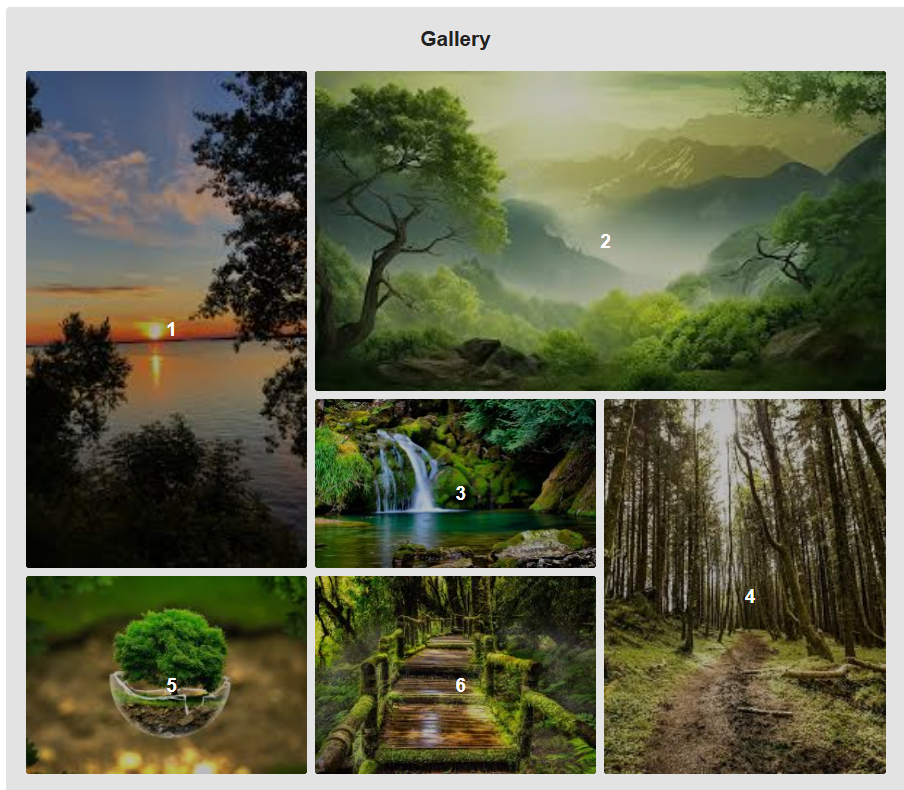

# CSS Grid Mastery – Advanced Image Gallery

## Project Overview

This project demonstrates how to create a responsive image gallery using CSS Grid.
The layout uses advanced grid positioning to arrange images in a visually appealing pattern and adapts to smaller screens using media queries.

The gallery includes hover effects, responsive design, and modern CSS techniques such as object-fit, CSS Grid, and transform animations.

🔗 Live Site:
[Live](https://bboxproject.netlify.app/)

##  Screenshot

